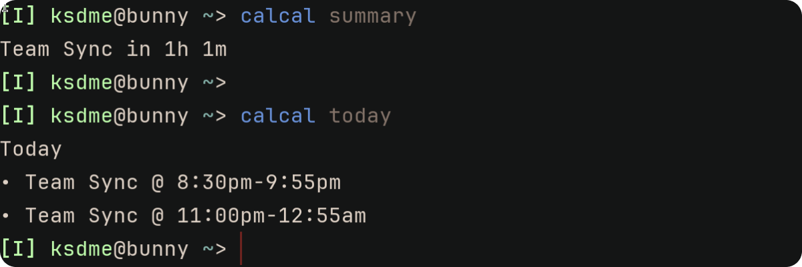
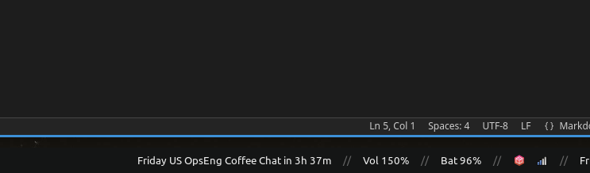

# calcal

<p align="center">
  
</p>

<p align="center">
  a cli to fetch your current and upcoming events from your Evolution/Gnome calendar
</p>

## What?

`calcal` is a tool that pulls events from your EDS (Evolution Data Server) compatible calendar applications. You
can use it to build integrations around your calendars. I built it so I can have information about upcoming
meetings in my [Waybar](https://github.com/Alexays/Waybar).

`calcal` can:
- Show a human summary of the current ongoing events.
- Show a human summary of upcoming events from your calendars.
- Show a summary of all the events scheduled for today.

## Setting up calcal

### Installing `calcal`

`calcal` is a Rust project. You can install it using `cargo`.

```
cargo install --git https://github.com/ksdme/calcal.git
```

If you do not have `rustc` or `cargo` installed, look into [rustup](https://rustup.rs/).

### Setting up calendars

`calcal` does not manage your calendars. Instead, it expects you to use a [EDS (Evolution Data Server)](https://github.com/GNOME/evolution-data-server) compatible
calendar app.

I have tested `calcal` with the following calendar apps,
- [Evolution](https://help.gnome.org/users/evolution/stable/)
- [Gnome Calendar](https://apps.gnome.org/Calendar/)

So, if you don't have an EDS calendar app, install one and configure it. `calcal` should then be able to access those calendars.

Run the following command to see if everything works as expected. It should output a full list of your calendars.

```
calcal calendars
```

And, when you run the following command it should output a summary of the ongoing or upcoming events.

```
calcal summary
```

## Setting up Waybar

Once you have `calcal` working as expected, you can add it to your Waybar configuration as a [custom module](https://man.archlinux.org/man/extra/waybar/waybar-custom.5.en). Here's a sample configuration,

```json
{
  ...
  "modules-right": [
    "custom/calcal",
    ...
  ],

  "custom/calcal": {
    "exec": "calcal waybar",
    "return-type": "json",
    "interval": 60,
    "tooltip": true,
  },
}
```

And, this is how it looks with my configuration.

<p align="center">
  
</p>
